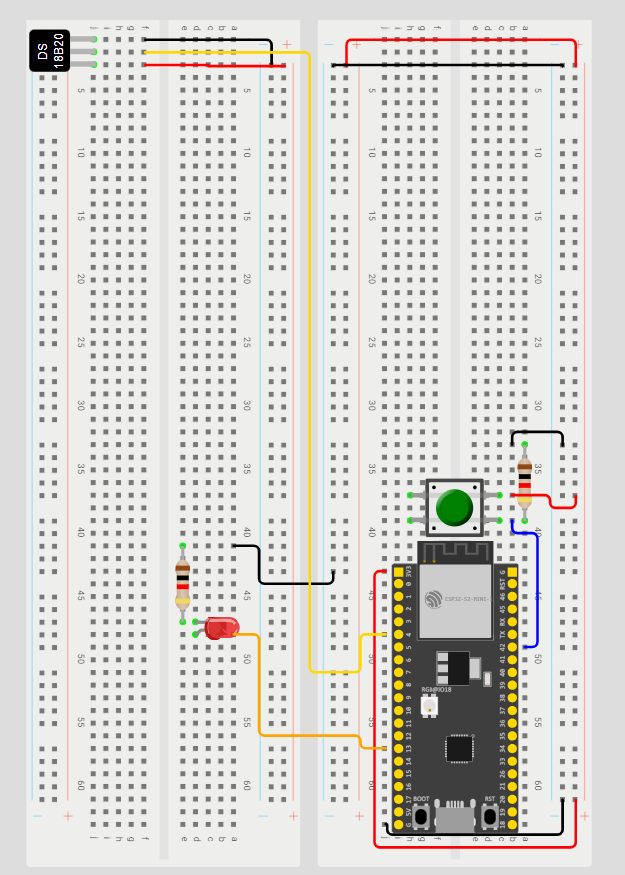

# 📡 Monitoramento de Temperatura com ESP32-S2 via MQTT

Este projeto utiliza uma **placa ESP32-S2** conectada a um **sensor de temperatura LM35DZ**, **um LED** e **um botão**, com o objetivo de monitorar a temperatura ambiente e enviar alertas via protocolo **MQTT**. Quando a temperatura ultrapassa um determinado valor limite, um LED é acionado e uma mensagem é enviada para o broker MQTT. Um botão físico permite o controle manual de reset de status.

## 🛠️ Hardware Utilizado

- **ESP32-S2** (modelo com suporte a Wi-Fi)
- **Sensor de temperatura LM35DZ**
- **LED** (com resistor limitador)
- **Botão tátil** (com resistor de pull-down)
- **Protoboard e jumpers**

## 🔌 Esquema de Montagem

Abaixo está o layout da montagem na protoboard:



### Conexões principais:

- **LM35DZ:**
  - VCC → 3.3V da ESP32-S2
  - GND → GND da ESP32-S2
  - OUT → Pino ADC (ex: GPIO1)

- **LED:**
  - Ânodo (positivo) → GPIO4 (via resistor de 220Ω)
  - Cátodo → GND

- **Botão:**
  - Um lado → GPIO5
  - Outro lado → GND (com resistor de 10kΩ pull-down)

## 🧠 Código

O projeto está dividido em dois arquivos:

- `mainSensorProject.ino`: Lógica principal do programa, leitura de temperatura, controle de LED, envio MQTT.
- `generalFunctions.ino`: Funções auxiliares reutilizáveis (como configuração de Wi-Fi e MQTT).

## ⚙️ Funcionalidades

- Leitura contínua da temperatura ambiente com o sensor LM35DZ.
- Publicação dos dados no **broker MQTT** configurado.
- LED é acionado caso a temperatura ultrapasse o valor limite.
- Botão físico pode ser usado para desligar o LED ou resetar a lógica.
- Comunicação leve e eficiente via protocolo **MQTT**.

## 📦 Bibliotecas Necessárias

Certifique-se de instalar as seguintes bibliotecas no Arduino IDE:

- `WiFi.h`
- `PubSubClient.h`

## 📡 Configuração MQTT

No código, configure os seguintes parâmetros:

```cpp
const char* ssid = "SEU_WIFI";
const char* password = "SENHA_WIFI";
const char* mqtt_server = "BROKER_IP";
const int mqtt_port = 1883;
```

## ✅ Objetivo do Projeto

- Aplicar conceitos de Internet das Coisas (IoT) com microcontroladores.
- Monitorar remotamente a temperatura ambiente.
- Utilizar comunicação MQTT para integração com um sistema central (ex: Raspberry Pi).
